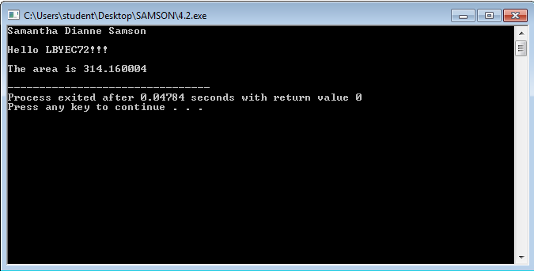
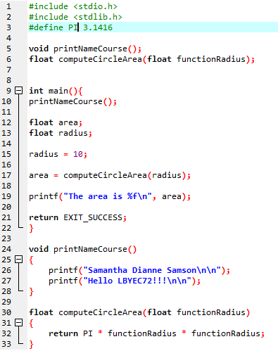

# LBYEC72-Practice
```c
#include <stdio.h>
#include <stdlib.h>
#define PI 3.1416

void printNameCourse();
float computeCircleArea(float functionRadius);


int main(){
printNameCourse();
	
float area;
float radius;
	
radius = 10;
	
area = computeCircleArea(radius);
	
printf("The area is %f\n", area);

return EXIT_SUCCESS;
}

void printNameCourse()
{
	printf("Samantha Dianne Samson\n\n");
    printf("Hello LBYEC72!!!\n\n");
}

float computeCircleArea(float functionRadius)
{	
	return PI * functionRadius * functionRadius;
}

```


